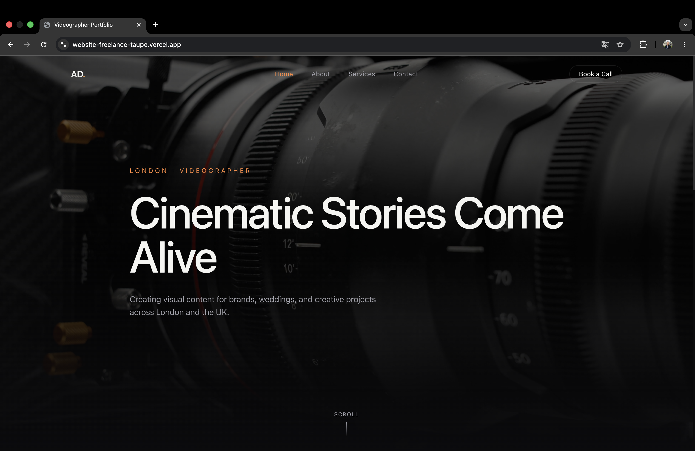

# Filmmaker Portfolio — Production Client Project

**Live:** https://advideography.com

A real client project for a London-based videographer: a cinematic portfolio site with CMS-driven content, a secured contact pipeline, and GDPR compliance — designed, built, and shipped to production end-to-end.



## Stack

Next.js 15 (App Router) · TypeScript · Tailwind CSS · Sanity CMS v3 · Framer Motion · Resend · Upstash Redis · Vercel

## What's inside

- **Fully CMS-driven content** — every page (home, about, services, work, contact) is editable by the client in an embedded Sanity Studio at `/studio`: hero copy, services, project gallery, site settings. No developer needed for content changes
- **Project gallery** with client-side category filtering, YouTube/Vimeo lightbox, and support for Reels/Shorts formats
- **Contact form pipeline** — API route with Resend email delivery and durable rate limiting (3 requests / 15 min per IP) via Upstash Redis sliding window; falls back to an in-memory limiter in local dev
- **Security headers** — Content-Security-Policy, X-Frame-Options and friends configured in `next.config.ts`
- **GDPR** — cookie banner + privacy policy page; cookieless Vercel Analytics
- **ISR** — `revalidate = 60`, so client content edits go live within a minute without redeploys
- **Custom typography** — self-hosted variable font (Clash Display), `font-display: swap`

## Architecture

```
app/
├── (site)/          # Public routes: home, about, services, work, contact
├── api/contact/     # Contact form endpoint (Resend + rate limiting)
└── studio/          # Embedded Sanity Studio
components/
├── layout/          # Navbar, Footer
├── sections/        # Hero, CTA
├── ui/              # GalleryGrid, VideoEmbed, ContactForm, CookieBanner...
└── motion/          # RevealOnScroll, PageTransition (Framer Motion)
sanity/
├── schemaTypes/     # project, service, page, siteSettings
└── lib/             # client, GROQ queries, image helpers
```

## Challenges & decisions

- **Rate limiting on serverless:** an in-memory limiter resets on every cold start and isn't shared across instances, so it provides no real protection on Vercel. Moved to Upstash Redis with a sliding-window algorithm for durable, cross-instance limiting
- **Video handling:** the hero video and project reels went through several iterations — from static files to CMS-managed uploads with `.mov`/`.mp4` support and YouTube Shorts/Instagram Reels link-outs — so the client can manage all media without touching code
- **Client handoff:** structured content schemas and singleton site settings in Sanity so a non-technical client can safely edit everything; environment variables and admin access documented and transferred

## Running locally

```bash
npm install
cp .env.local.example .env.local   # fill in Sanity project ID; Resend/Upstash optional locally
npm run dev
```

Sanity Studio is available at `http://localhost:3000/studio`.

---

Built by [Vlad Danyliuk](https://github.com/VladDanyliuk)
